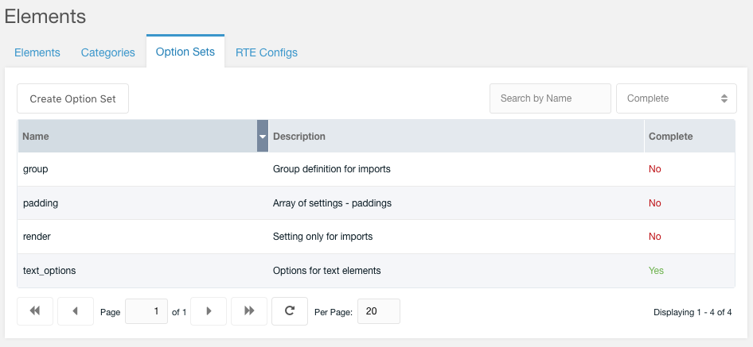

Option Set is an ideal way how to attach same set of options to multiple Elements.

### Creating Option Set
Option Set properties:

- Name - Required, has to be unique
- Description - Optional
- Complete - Yes/No flag, if set to Yes, the Option Set will appear in select box when creating/updating Element. Setting it to No is usefull for partial Option Sets for import only purpose.
- Data - JSON with [Element options](/elements/options)

 

