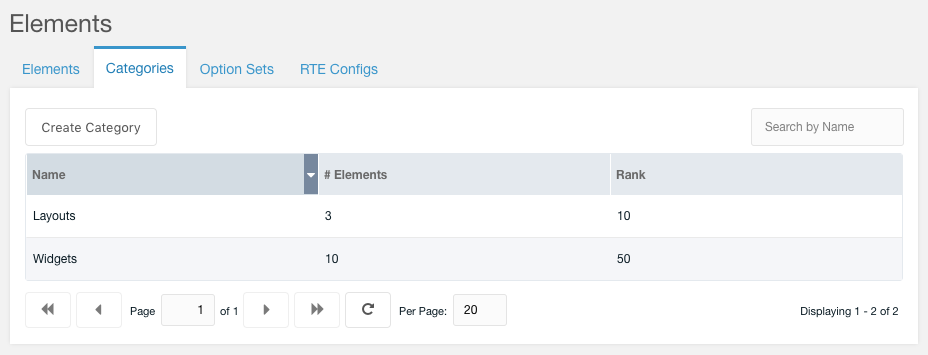

# Element Categories

Categories are an organizational strucure for Fred to group items with similar usage. Examples Element categories could be:

- Headers
- Page Separators
- Intro Blocks
- Galleries
- Body copy
- Quotes
- Forms
- Etc.

Under the Categories leftside tab on main Elements tab you can manage all Categories for Elements in Fred.

**Please note that if you remove a category, all Elements attached to it will be removed as well, which may break your site.**
