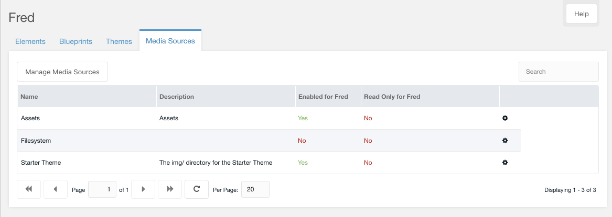
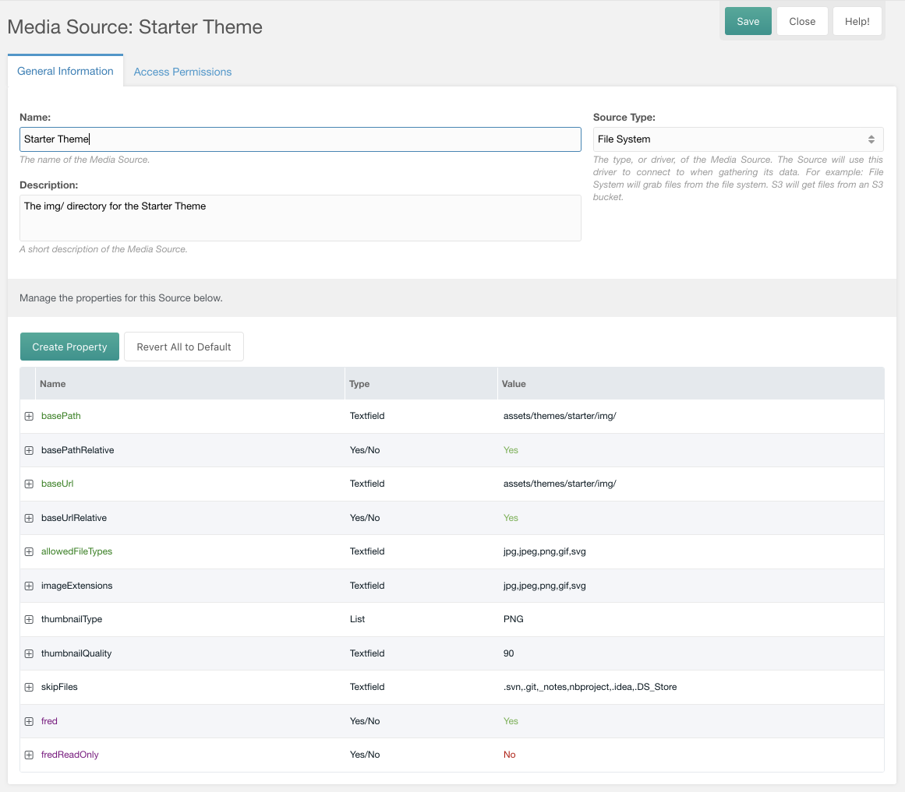

# Media Sources

Like when used in the MODX Manager, Media Sources allow Theme Authors to help site owners keep uploads organized in specific locations for Fred-powered sites. Different Fred Elements that allow uploading images may need to store files in different locations, for example article content vs. catalog images vs. team bio photos.

When editing a Media Source, Theme authors must explicitly set Media Sources to be accessible to Fred via the `fred` toggle; they can optionally be made read-only for Fred, by specifying this in the `fredReadOnly` toggle.  

Learn more about Media Sources in the [MODX Media Source documentation](https://docs.modx.com/revolution/2.x/administering-your-site/media-sources).
